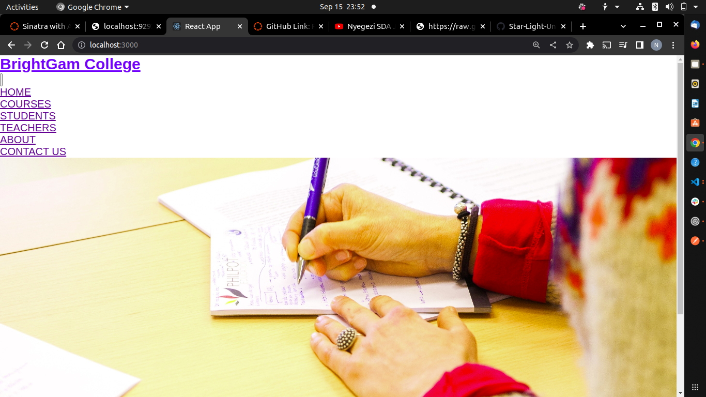
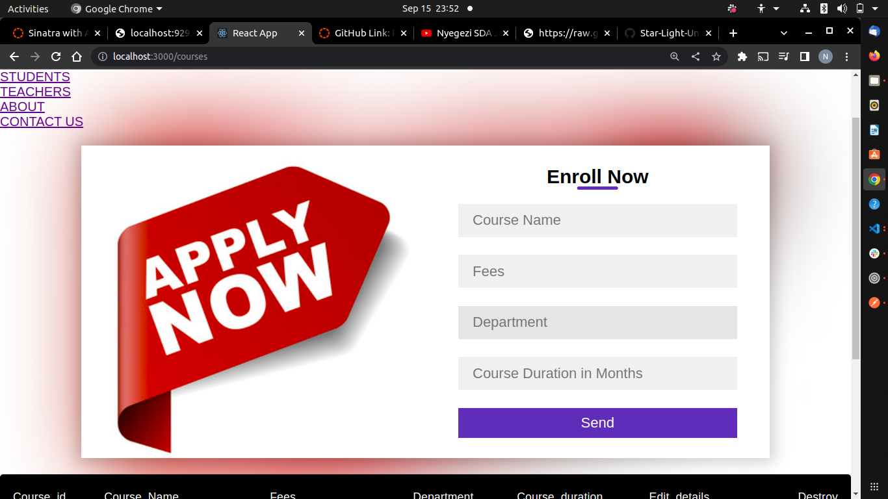

## Title

> > School Mangaement System

## Description

> > School system that ensures Courses Teachers and Students can be added and enrolled
## Setup/Installation Requirements

>> To acces this website you need to clone it using these steps

> > Open your terminal on you Ubuntu or Mac or commandprompt on windows
> > Change your current woking directory to the location where you want to clone the project.
> > Type $ git clone git@github.com:devblackie/Blackie-Outdoor.git
> > The command will clone the repository into the location folder selected.

## Known Bugs

> > No noticeable bugs identified.

## Visuals

>> HOME PAGE

>> COURSE SELECTION PAGE

##  Skills

> > - React Js , HTML , CSS, [front End]
> > - Ruby [back end]

## Features

> > - Booking event
> > - Choosing event

## GitHub Code

> > 

## Support and Contact Details

> > Incase you run into a problem, kindly contact  me on newtieblackie@gmail.com and also feel free to contribute to my code.

## Live Site

> > Go to <a src="/">Live</a>

## Licence

> > This project is under the MIT license:

## Copyright (c) 2022 Newton Mboi